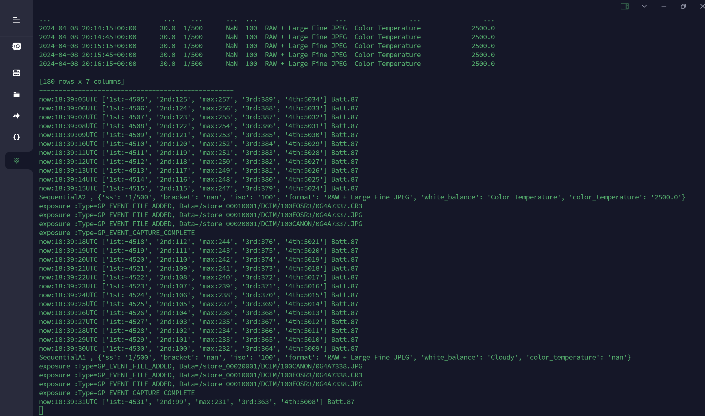
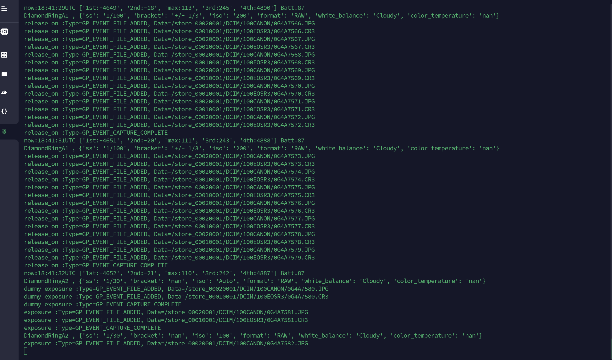

# eclipse_shooter

PythonでGPhoto2を利用してEOS 6Dなどのデジタルカメラを操作し、エクセルで指定したスクリプトに沿って自動的に日食の撮影を行います。
Raspberry piなどを利用して稼働させることでPCレスで撮影を行う事が出来ます。

* GPhoto2 対応機種リスト　http://www.gphoto.org/proj/libgphoto2/support.php

起動時に複数のカメラ接続を確認した場合には、どちらのカメラを操作するか選択することが出来ます。


# 自動撮影スクリプト例
サンプルコードでは **usa_eclipse.xlsx** を読み込み、列記された撮影シーケンスを実行します。 

撮影シーケンスは基準時刻(utc列)に対して相対値(秒)で指定された開始時間(time列)から開始し、指定した間隔(interval列)で指定した回数(count列)の撮影を行います。 

撮影条件はiso, ss, format, ホワイトバランス(色温度)が指定出来、カンマで複数指定した場合には列記した条件すべてを順に撮影します。

こちらの例 (**usa_eclipse.xlsx**) では、
* 第1接触時間の13分30秒前から第1接触の直前まで30秒ごとに「ホワイトバランス曇り」と「ホワイトバランス色温度2500K」を各180枚ずつ撮像
* 第2接触時間の前後50秒と第3接触時間の前後50秒にダイヤモンドリング撮影のため ISO100とISO AUTOを各1枚ずつ撮像（撮影間隔は最短間隔）
* 皆既中はシャッタースピードを 1/1000秒から1秒まで6段階のブラケット撮影を繰り返す（撮影間隔は最短間隔）
* 第3接触から第4接触後まで30秒ごとに「ホワイトバランス曇り」と「ホワイトバランス色温度2500K」を各180枚ずつ撮像

という撮影を行います。


# 必要なパッケージ

### GPhoto2 
* Gphoto2 公式ページ http://www.gphoto.org/

こちらの記事を参考にして GPhoto2をインストールしました。
https://www.moyashi-koubou.com/blog/dslr_camera_raspberrypi/

```
$ wget https://raw.githubusercontent.com/gonzalo/gphoto2-updater/master/gphoto2-updater.sh && wget https://raw.githubusercontent.com/gonzalo/gphoto2-updater/master/.env && chmod +x gphoto2-updater.sh && sudo ./gphoto2-updater.sh
```

### libcblas.so.3
```
$ sudo apt-get install libatlas-base-dev
```

### Pythonのライブラリパッケージ

動作に必要なライブラリを pip install などでインストールします。(括弧内は当方で動作確認済みのバージョン)
* numpy (1.25.2)
* pandas (2.0.3)
* openpyxl (3.1.2)
* gphoto2 (2.5.0)

# Raspberry Pi 環境構築例

実際の設定手順や動作確認方法を下記のnoteに記載しておきました。
参考にしてみてください。 

* Eclipse ShooterのためのRaspberry Piの設定  https://note.com/kiy0sh/n/nbba8a7eccc96


# 実行結果例






実行すると、カレントフォルダに eclipse_shooter.log というログファイルが作成されます。
コンソールには表示されない詳細な情報が保存されていますので、デバッグなどに利用してください。
ログファイルは都度追記されますので、必要に応じて削除してください。

# 動作確認

* EOS R3 (モードダイアルはMモードにしてください。)
* EOS RP (モードダイアルはMモードにしてください。)
* EOS 6D (モードダイアルはMモードにしてください。)


# 免責事項

* 必ずご自身で動作確認して、ご自身の責任においてご使用ください。
* 日食のタイミングに上手く動作しなかったとしても保証しかねます。
